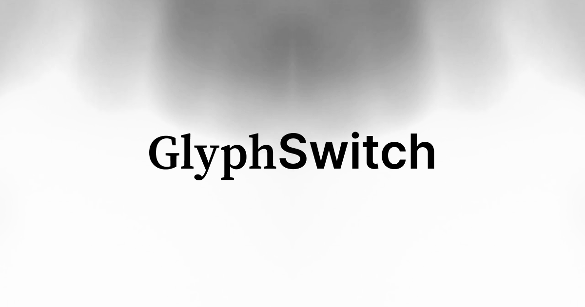

# GlyphSwitch

Easily switch between multiple fonts in your app! Perfect for developers who want to offer dynamic font choices and improve user experience with just a toggle.

---

## Features

- Switch between multiple fonts
- Persist user font choice with `localStorage`
- Fully customizable font options and UI
- Works with Next.js app directory & React 18+

---

## Setup

Clone and install

```bash
git clone https://github.com/BrahimBoussada/glyph-switch.git
cd glyph-switch
npm install
npm run dev
```

## How it Works

### 1. Import Fonts in your layout

```tsx
import { Geist, Lora, Fira_Mono } from "next/font/google";

const geistSans = Geist({
  variable: "--font-sans",
  weight: ["400", "600", "700"],
  subsets: ["latin"],
});
const crimsonSerif = Lora({
  variable: "--font-serif",
  weight: ["400", "600", "700"],
  subsets: ["latin"],
  style: ["normal", "italic"],
});
const jetBrainMono = Fira_Mono({
  variable: "--font-mono",
  weight: ["400"],
  subsets: ["latin"],
});

export default function RootLayout({
  children,
}: {
  children: React.ReactNode;
}) {
  return (
    <html
      lang="en"
      className={`${geistSans.variable} ${crimsonSerif.variable} ${jetBrainMono.variable}`}
    >
      <body>
        <FontProvider>{children}</FontProvider>
      </body>
    </html>
  );
}
```

---

### 2. Define CSS variables and font families in your global CSS

```css
:root {
  --font-sans: "Geist", sans-serif;
  --font-serif: "Lora", serif;
  --font-mono: "Fira Mono", monospace;
}
```

---

### 3. Create Font Context (`font-context.tsx`)

```tsx
import { createContext, useContext, useEffect, useState } from "react";

export type FontType = "sans" | "serif" | "mono"; // Customize this to add/remove fonts

interface FontContextProps {
  font: FontType;
  setFont: (font: FontType) => void;
}

const FontContext = createContext<FontContextProps | undefined>(undefined);

export const FontProvider = ({ children }: { children: React.ReactNode }) => {
  const [font, setFontState] = useState<FontType | null>(null);

  useEffect(() => {
    const storedFont = (localStorage.getItem("font") as FontType) || "sans";
    document.documentElement.classList.add(`font-${storedFont}`);
    setFontState(storedFont);
  }, []);

  const setFont = (newFont: FontType) => {
    if (!font) return;
    document.documentElement.classList.remove(`font-${font}`);
    document.documentElement.classList.add(`font-${newFont}`);
    localStorage.setItem("font", newFont);
    setFontState(newFont);
  };

  if (!font) return null;

  return (
    <FontContext.Provider value={{ font, setFont }}>
      {children}
    </FontContext.Provider>
  );
};

export const useFont = (): FontContextProps => {
  const context = useContext(FontContext);
  if (!context) throw new Error("useFont must be used within FontProvider");
  return context;
};
```

---

### 4. Add font initialization inline script in `<head>` (`Head.tsx`) to prevent flicker

```tsx
export default function Head() {
  return (
    <script
      dangerouslySetInnerHTML={{
        __html: `
          try {
            const font = localStorage.getItem('font') || 'sans';
            document.documentElement.classList.add('font-' + font);
          } catch {}
        `,
      }}
    />
  );
}
```

---

### 5. Create a UI toggle component (`FontToggle.tsx`)

```tsx
import { useFont } from "@/context/font-context";

const fonts = [
  { name: "sans", label: "Default" },
  { name: "serif", label: "Serif" },
  { name: "mono", label: "Mono" },
];

export default function FontToggle() {
  const { font, setFont } = useFont();

  return (
    <div>
      {fonts.map((f) => (
        <button
          key={f.name}
          onClick={() => setFont(f.name)}
          style={{ fontWeight: font === f.name ? "bold" : "normal" }}
        >
          {f.label}
        </button>
      ))}
    </div>
  );
}
```

---

## Customization

- Change available fonts by editing FontType type.
- Add your own fonts and CSS variables.
- Update toggle UI to match your design.

---

## Contributing

Contributions and suggestions are welcome! Feel free to open an issue or submit a PR.

---

## License

MIT © Brahim Boussada
